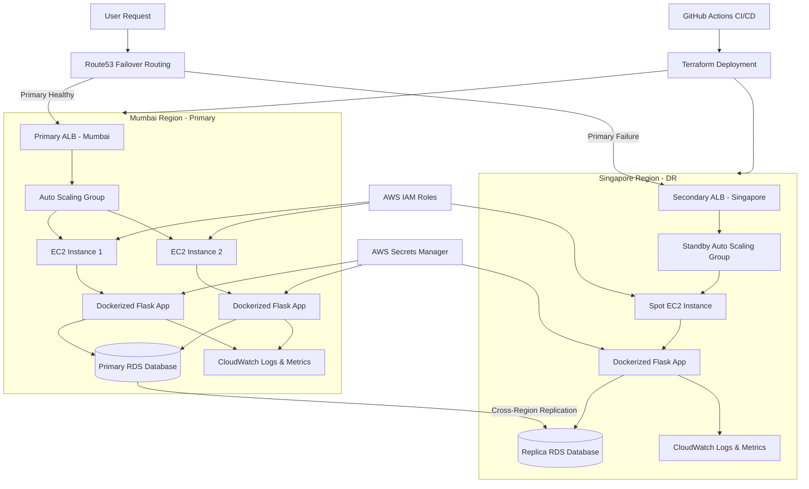

# AWS Multi-Region Disaster Recovery System

Multi-Region Disaster Recovery (DR) and High Availability platform built using AWS, Terraform, Docker, Flask, Python, and GitHub Actions.
---

# Project Highlights

* Multi-region AWS deployment
* Automated Route53 failover
* Active-Passive Disaster Recovery architecture
* Infrastructure as Code using Terraform
* Dockerized Flask microservice
* Cross-region RDS replication
* Auto Scaling and Load Balancing
* Runtime secret management using AWS Secrets Manager
* DevSecOps security scanning with Checkov and Trivy
* CI/CD pipelines using GitHub Actions
* CloudWatch observability and monitoring
* Cost optimization using Spot Instances
* Failure simulation and DR testing
* Structured JSON logging
* Region-aware APIs for failover visibility
* Database-backed workload simulation

---

# Architecture Overview

The platform is deployed across two AWS regions:

| Region                       | Role                               |
| ---------------------------- | ---------------------------------- |
| Mumbai (`ap-south-1`)        | Primary Production Region          |
| Singapore (`ap-southeast-1`) | Secondary Disaster Recovery Region |

The primary region handles live production traffic while the secondary region acts as a standby recovery environment.

Amazon Route53 continuously monitors the health of the primary region and automatically redirects traffic to the backup region if a failure occurs.

---

# Enterprise Architecture Diagram (Mermaid)



---

# Disaster Recovery Workflow

## Normal Operation

```text
User → Route53 → Mumbai ALB → EC2 Auto Scaling Group → Dockerized Flask App → RDS
```

## During Failure

If the Mumbai region becomes unavailable:

1. Route53 health checks fail
2. DNS failover is triggered
3. Traffic is redirected to Singapore
4. Backup infrastructure becomes active
5. Application continues serving requests

## Failover Traffic Flow

```text
User → Route53 → Singapore ALB → Standby EC2 → Flask App → Replica RDS
```

---

# Technology Stack

## Cloud Services

* Amazon EC2
* Amazon VPC
* Amazon Route53
* Amazon RDS
* Amazon CloudWatch
* Amazon ECR
* AWS IAM
* AWS Secrets Manager
* Auto Scaling Groups
* Application Load Balancer

## DevOps & Infrastructure

* Terraform
* Docker
* GitHub Actions
* Python
* Bash

## Backend Application

* Flask
* REST APIs
* Structured Logging
* Health Checks
* Metrics Endpoints
* Region Awareness

## DevSecOps Tools

* Checkov
* Trivy

---

# Project Structure

```bash
AWS-Multi-Region-Disaster-Recovery-System/
│
├── app/
│   ├── app.py
│   ├── Dockerfile
│   └── requirements.txt
│
├── scripts/
│   ├── spinup.py
│   ├── teardown.py
│   └── test_failover.py
│
├── terraform/
│   ├── global/
│   ├── modules/
│   │   ├── alb/
│   │   ├── ec2/
│   │   ├── monitoring/
│   │   ├── rds/
│   │   └── vpc/
│   │
│   └── regions/
│       ├── mumbai/
│       └── singapore/
│
├── .github/
│   └── workflows/
│       ├── deploy.yml
│       └── destroy.yml
│
├── deploy.py
├── config.yaml
└── README.md
```

---

# Flask Microservice Features

The Flask application was designed as a cloud-native microservice workload for demonstrating real disaster recovery behavior.

## Key Features

### REST APIs

Supports:

* Create data
* Read data
* Health checks
* Failure simulation

### Region Awareness

The application dynamically displays:

* active AWS region
* hostname
* infrastructure state

This allows live visualization of failover events.

### Structured JSON Logging

Production-style JSON logs are generated for:

* requests
* errors
* health checks
* database operations

### Database Integration

The application connects to Amazon RDS for:

* persistent storage
* workload simulation
* replication validation

### Failure Simulation Endpoint

```bash
/simulate-fail
```

Used to intentionally trigger unhealthy behavior for:

* DR testing
* Route53 failover validation
* resilience demonstrations

### Deep Health Checks

Health endpoints validate:

* application status
* database connectivity
* service availability

---

# Infrastructure as Code (Terraform)

The entire infrastructure is provisioned using modular Terraform architecture.

## Terraform Modules

### VPC Module

Creates:

* VPC
* Public Subnets
* Private Subnets
* Internet Gateway
* Route Tables
* NAT Gateway

### ALB Module

Creates:

* Application Load Balancer
* Target Groups
* Listeners
* Health Checks

### EC2 Module

Creates:

* EC2 instances
* Auto Scaling Groups
* Launch Templates
* IAM Roles
* Docker runtime automation

### RDS Module

Creates:

* Primary database
* Cross-region replica database

### Monitoring Module

Creates:

* CloudWatch dashboards
* alarms
* infrastructure monitoring

---

# Docker & Containerization

The Flask application is fully containerized using Docker.

## Benefits

* Immutable deployments
* Environment consistency
* Faster scaling
* Rapid disaster recovery
* Easier CI/CD integration

## Container Startup Automation

EC2 User Data automatically:

* installs Docker
* authenticates with ECR
* pulls container images
* retrieves secrets
* launches containers

---

# Auto Scaling & High Availability

Auto Scaling Groups automatically adjust infrastructure capacity based on demand.

## Benefits

* High availability
* Elastic scaling
* Fault tolerance
* Self-healing infrastructure

The Application Load Balancer distributes traffic only to healthy instances.

---

# RDS & Database Replication

Amazon RDS is used to provide:

* managed relational database services
* automatic backups
* cross-region replication
* disaster recovery support
* persistent application storage

## Replication Strategy

Primary database:

* Mumbai region

Replica database:

* Singapore region

This ensures application data remains available even during regional failures.

---

# Security Architecture

The project follows multiple enterprise-grade security practices.

## IAM Role-Based Access

EC2 instances use IAM Roles instead of hardcoded credentials.

## AWS Secrets Manager

Sensitive credentials are securely retrieved at runtime.

## Network Isolation

* EC2 instances are protected behind ALBs
* databases remain inside private subnets
* security groups restrict unauthorized traffic

## DevSecOps Security Scanning

### Checkov

Scans Terraform code for infrastructure misconfigurations.

### Trivy

Scans Docker containers for vulnerabilities and CVEs.

---

# CI/CD Pipeline

GitHub Actions automates infrastructure deployment and security validation.

## Deployment Workflow

### deploy.yml

Pipeline stages:

1. Checkout repository
2. Setup Python
3. Install dependencies
4. Setup Terraform
5. Run Checkov scan
6. Run Trivy scan
7. Deploy infrastructure

## Destroy Workflow

### destroy.yml

Used for:

* infrastructure teardown
* cloud cost optimization
* cleanup automation

---

# Observability & Monitoring

Amazon CloudWatch provides infrastructure observability.

## Monitored Metrics

* CPU utilization
* EC2 health
* application availability
* scaling events
* health check failures
* regional availability

## Logging

Structured JSON logs improve:

* debugging
* monitoring
* centralized logging
* operational visibility

---

# Cost Optimization

The disaster recovery region uses Spot Instances to reduce standby operational costs.

## Operational Scripts

### teardown.py

Used to destroy infrastructure and reduce AWS billing.

### spinup.py

Used to quickly restore infrastructure.

---

# Disaster Recovery Testing

The project includes dedicated DR testing capabilities.

## test_failover.py

Used to:

* simulate regional outages
* validate Route53 failover
* test resilience behavior
* demonstrate automated recovery

---

# Deployment Instructions

## Prerequisites

Install:

* Python 3.x
* Terraform
* Docker
* AWS CLI
* Git

Configure AWS credentials:

```bash
aws configure
```

---

# Clone Repository

```bash
git clone https://github.com/Poras2005/AWS-Multi-Region-Disaster-Recovery-System.git

cd AWS-Multi-Region-Disaster-Recovery-System
```

---

# Install Dependencies

```bash
pip install -r app/requirements.txt
```

---

# Deploy Infrastructure

```bash
python deploy.py
```

---

# Run Failover Test

```bash
python scripts/test_failover.py
```

---

# Tear Down Infrastructure

```bash
python scripts/teardown.py
```

---

# Restore Infrastructure

```bash
python scripts/spinup.py
```

---

# Engineering Concepts Demonstrated

## Cloud Engineering

* AWS architecture
* Multi-region deployment
* High availability
* Disaster recovery

## DevOps

* Infrastructure as Code
* CI/CD automation
* Docker workflows
* deployment pipelines

## Site Reliability Engineering (SRE)

* health checks
* observability
* failover testing
* structured logging
* reliability engineering

## DevSecOps

* infrastructure security scanning
* container vulnerability scanning
* IAM least privilege
* secure secret management

## FinOps

* spot instance optimization
* automated teardown tooling
* resource lifecycle management

---

# Future Improvements

Potential future enhancements:

* Kubernetes (EKS/ECS)
* Prometheus + Grafana monitoring
* AWS WAF integration
* Blue-Green deployments
* Lambda-driven automated failover
* Distributed tracing
* Chaos Engineering testing
* OpenTelemetry observability

---

# Learning Outcomes

This project demonstrates practical experience in:

* AWS Cloud Engineering
* DevOps Automation
* Infrastructure as Code
* Disaster Recovery Architecture
* High Availability Systems
* Site Reliability Engineering
* DevSecOps
* Cloud Security
* Docker & Containerization
* Observability & Monitoring
* CI/CD Pipelines

---